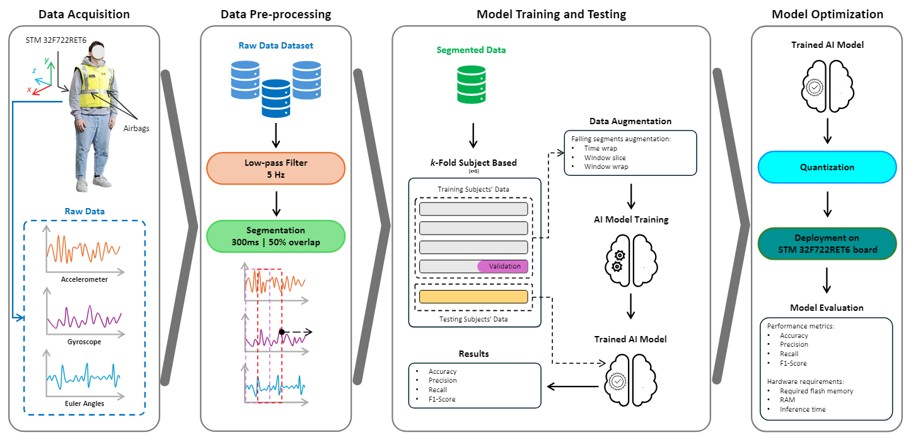
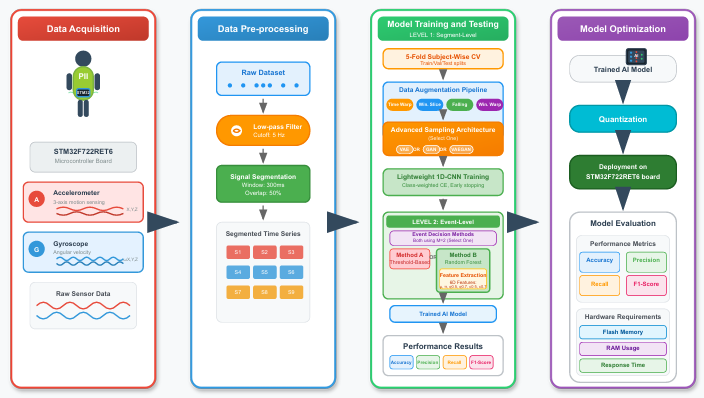

<!DOCTYPE html>
<html lang="en">
<head>
    <meta charset="UTF-8">
    <meta name="viewport" content="width=device-width, initial-scale=1.0">
    <title>PhD Final Presentation - Muhammad Toqeer Ali</title>
    
</head>
<body>

    

        
        
    

    
        <!-- Admin Controls -->
    

        <h4>💬 Comment System</h4>
        <label class="toggle-switch">
            <input type="checkbox" id="enableComments" checked onchange="toggleCommentsSystem()">
            
        </label>
        Enable Comments
          
        

            <button class="btn btn-secondary" onclick="exportAllComments()" style="font-size: 11px; padding: 6px 20px;">
                📁 Export
            </button>
            <button class="btn btn-secondary" onclick="clearAllComments()" style="font-size: 11px; padding: 6px 10px; background: #dc3545;">
                🗑️ Clear
            </button>
        

    

    

        

            Slide 1 of 31
        

        <!-- Slide 1: Title -->
        

            

                

                    UNIVERSITÀ DI VERONA 
                    Department of Engineering for Innovation Medicine 
                    PhD Program in Computer Science
                

                <h1 class="main-title">Assistive Solutions for Frail People</h1>
                
From Sleep Monitoring to Pre-Impact Fall Detection A Complete PhD Journey

                

                    <strong>Author:</strong> Muhammad Toqeer Ali 
                    <strong>Supervisor:</strong> Prof. Graziano Pravadelli 
                    <strong>Co-Supervisor:</strong> Dr. Florenc Demrozi 
                    <strong>Academic Year:</strong> 2022-2025
                

                

                    September 2025
                

            

        

<!-- Updated Table of Contents with Correct Slide Alignment -->
        

            

                <h2>📚 Table of Contents</h2>
                
2/31

            

            

                

                    

                        <h3>
🎯
Foundation & Goals</h3>
                        

                            
3

                            
PhD Goals & PNRR Alignment

                        

                        

                            
4

                            
Research Evolution Timeline

                        

                        

                            
5

                            
Strategic Pivot Justification

                        

                    

                    
                    

                        <h3>
📚
Year 1 (2022-2023)</h3>
                        

                            
6

                            
Systematic Literature Review

                        

                        

                            
7

                            
PRISMA Flow Diagram

                        

                        

                            
8

                            
IEEE Access Publication

                        

                        

                            
9

                            
Technology Domain Analysis

                        

                    

                    
                    

                        <h3>
🎯
Year 2 (2023-2024)</h3>
                        

                            
10

                            
Strategic Pivot to Fall Detection

                        

                        

                            
11-13

                            
Fall Stages & Pre-Impact Innovation

                        

                        

                            
14-16

                            
Lightweight CNN Development

                        

                        

                            
17-19

                            
Implementation & Results

                        

                        

                            
19

                            
DATE 2025 Best Paper Award

                        

                    

                    
                    

                        <h3>
🚧
Year 2→3 Transition</h3>
                        

                            
20

                            
Real-World Challenge Discovery

                        

                        

                            
21

                            
Field Testing Issues Analysis

                        

                    

                    
                    

                        <h3>
🚀
Year 3 (2024-2025)</h3>
                        

                            
22

                            
Updated Methodology Pipeline

                        

                        

                            
23-24

                            
Advanced Data Augmentation

                        

                        

                            
25-26

                            
Event-Level Classification

                        

                        

                            
27

                            
Breakthrough Performance Results

                        

                    

                    
                    

                        <h3>
🌍
Collaboration & Impact</h3>
                        

                            
28

                            
International Collaboration Network

                        

                        

                            
29

                            
Publications and Recognition

                        

                        

                            
30

                            
Conclusion & Mission Accomplished

                        

                        

                            
31

                            
Thank You & Questions

                        

                    

                

                
                

                    <h3>🎯 Journey Outcome: From Research Foundation to Commercial-Ready Technology</h3>
                

            

        

        <!-- Slide 3: PhD Goals and PNRR Alignment -->
        

            

                <h2>PhD Goals & PNRR Alignment</h2>
                
3/31

            

            

                

                    <h3>🎯 Primary PhD Objective (2022)</h3>
                    
Define and implement assistive home automation solutions and virtual coaching tools based on wearable systems and IoT for Parkinson's patients and elderly populations.

                

                
                

                    

                        <h3 style="color: #2c5aa0;">🇮🇹 PNRR Mission Alignment</h3>
                        

                            
1

                            
<strong>Mission 1:</strong> Digital Transformation through IoT & AI

                        

                        

                            
5

                            
<strong>Mission 5:</strong> Social Inclusion for aging populations

                        

                        

                            *Note: Missions 2-4 address different domains (environment, infrastructure, education) not directly relevant to this research
                        

                    

                    
                    

                        <h3 style="color: #2c5aa0;">🎯 Initial Target Applications</h3>
                        

                            
🏠

                            
<strong>Home Monitoring:</strong> Assistive automation solutions

                        

                        

                            
😴

                            
<strong>Sleep Monitoring:</strong> Parkinson's patient care

                        

                        

                            
🚨

                            
<strong>Fall Detection:</strong> Emergency response systems

                        

                    

                

                
                

                    <h3>💭 Research Philosophy</h3>
                    
Maintain core objectives while adapting technical approaches based on practical constraints and emerging opportunities

                

            

        

        <!-- Slide 4: Research Evolution Timeline -->
        

            

                <h2>Research Evolution Timeline</h2>
                
4/31

            

            

                

                    

                        

                        
2022-2023: Foundation Year

                        
<strong>Literature Review:</strong> Analyzed 2,459 papers on ICT-based Alzheimer's care solutions <cite>[1]</cite>

                        
<strong>Publication:</strong> IEEE Access survey paper establishing field overview

                        
<strong>Technical Exploration:</strong> Initial sleep monitoring system development using BAN devices

                    

                    
                    

                        

                        
2023-2024: Strategic Pivot

                        
<strong>Direction Change:</strong> Transitioned from sleep monitoring to fall detection

                        
<strong>Achievement:</strong> 86.69% F1-score with lightweight CNN on STM32 <cite>[2]</cite>

                        
<strong>Recognition:</strong> DATE 2025 Best Paper Award

                    

                
                    

                        

                        
2024-2025: Real-World Challenges & Breakthrough

                        
<strong>Challenge Identified:</strong> Year 2 field testing revealed false alarms from sudden construction movements

                        
<strong>Systematic Solutions:</strong> New construction dataset + Prof. Fadi collaboration (Norway) + Event-level classification

                        
<strong>Final Success:</strong> 99.56% F1-score with real-world validation + IEEE Sensors manuscript ready <cite>[4]</cite>

                    

                

                
                

                    

                        
Literature Foundation

                        
2,459 Papers

                    

                    

                        
Strategic Success

                        
Sleep→Fall Detection

                    

                    

                        
Final Performance

                        
99.56% F1-Score

                    

                

            

        

        <!-- Slide 5: Strategic Pivot Justification -->
        

            

                <h2>Strategic Pivot: Sleep Monitoring → Fall Detection</h2>
                
5/31

            

            

                

                    

                        <h3 style="color: #d32f2f;">❌ Sleep Monitoring Challenges</h3>
                        

                            
!

                            
Multi-modal sensor complexity (EEG, EOG)

                        

                        

                            
!

                            
Clinical validation requirements

                        

                        

                            
!

                            
Regulatory compliance complexity

                        

                        

                            
!

                            
Limited patient access

                        

                    

                    
                    

                        <h3 style="color: #4caf50;">✓ Fall Detection Advantages</h3>
                        

                            
✓

                            
Leverages existing BAN expertise

                        

                        

                            
✓

                            
Manageable validation requirements

                        

                        

                            
✓

                            
Multiple application domains

                        

                        

                            
✓

                            
Industry partnership alignment

                        

                    

                

                
                

                    <h3>🎯 Strategic Decision</h3>
                    
Maintaining core objective of assistive solutions for frail populations while adapting technical approach to available resources and practical deployment considerations.

                

            

        

        <!-- YEAR 1 DETAILED SLIDES START HERE -->

        <!-- Slide 6: Year 1 Overview -->
        

            

                <h2>📚 Year 1 (2022-2023): Foundation & Discovery</h2>
                
6/31

            

            

                

                    <h3>🎯 Year 1 Mission: Building Comprehensive Foundations</h3>
                    
Establish deep domain knowledge in assistive technologies while exploring initial technical approaches for neurodegenerative disease monitoring

                

                
                

                    

                        <h3>📖 Systematic Literature Review</h3>
                        

                            
🔍

                            
<strong>PRISMA Methodology:</strong> Rigorous systematic approach

                        

                        

                            
📊

                            
<strong>Scope:</strong> ICT solutions for Alzheimer's Disease care

                        

                        

                            
🌐

                            
<strong>Multi-database Search:</strong> IEEE, ACM, Scopus, PubMed, WoS

                        

                    

                    
                    

                        <h3>🔬 Technical Exploration</h3>
                        

                            
🛠️

                            
<strong>BAN Enhancement:</strong> Body Area Network upgrades

                        

                        

                            
😴

                            
<strong>Sleep Monitoring:</strong> Parkinson's patient focus

                        

                        

                            
⚡

                            
<strong>Multi-modal Sensors:</strong> EEG, EOG integration

                        

                    

                

                
                

                    

                        
2,459

                        
Papers Analyzed

                    

                    

                        
8

                        
Technology Domains

                    

                    

                        
46

                        
Final Studies Selected

                    

                    

                        
6

                        
Months Intensive Work

                    

                

                
                

                    <h3>🎯 Key Outcome: Research Gap Identification</h3>
                    
<strong>Critical Finding:</strong> Most existing solutions were reactive rather than proactive, focusing on post-incident response instead of prevention—this insight directly shaped the subsequent fall detection research direction.

                

            

        

        <!-- Slide 7: PRISMA Flow Diagram -->
        

            

                <h2>📊 PRISMA Systematic Review Process</h2>
                
7/31

            

            

                

                    
                

                
Figure 1: PRISMA flow diagram illustrating the systematic screening process from 2,459 initial records through duplicate removal, title/abstract screening, and full-text evaluation to the final selection of 46 relevant studies <cite>[1]</cite>.

                
                

                    

                        <h3>📚 Initial Search</h3>
                        
<strong>2,459 Records</strong> Multi-database query Jan 2015 - Mar 2023

                    

                    

                        <h3>🔍 Duplicate Removal</h3>
                        
<strong>2,180 Unique</strong> Automated + Manual Quality screening

                    

                    

                        <h3>📖 Full-Text Review</h3>
                        
<strong>46 Selected</strong> Inclusion criteria Quality assessment

                    

                

                
                

                    <h3>🎯 Inclusion Criteria Applied</h3>
                    

                        
✓

                        
Focus on Alzheimer's disease (title, keywords, or abstract mention)

                    

                    

                        
✓

                        
Published in English with full-text availability

                    

                    

                        
✓

                        
Original research (excluding reviews and editorials)

                    

                    

                        
✓

                        
ICT-based technological intervention or solution

                    

                

            

        

        <!-- Slide 8: Technology Domain Analysis -->
        

            

                <h2>🔬 Eight Technology Domains Framework</h2>
                
8/31

            

            

                

                    
                

                
Figure 2: Overview of the systematic survey structure exploring technological innovations across eight major domains in Alzheimer's care, showing the comprehensive approach to technology categorization <cite>[1]</cite>.

                
                

                    

                        <h4>🏥 Healthcare-Focused Domains</h4>
                        

                            
📱

                            
<strong>Telemedicine & E-Health:</strong> Remote monitoring and consultation systems

                        

                        

                            
🏠

                            
<strong>Smart Environments:</strong> Ambient assisted living solutions

                        

                        

                            
🩺

                            
<strong>Internet of Medical Things:</strong> Connected medical devices

                        

                        

                            
👤

                            
<strong>Personalized Assistive Solutions:</strong> Adaptive care systems

                        

                    

                    
                    

                        <h4>💻 Technology-Focused Domains</h4>
                        

                            
🌐

                            
<strong>Internet of Things (IoT):</strong> Connected device networks

                        

                        

                            
📡

                            
<strong>Wearable & Environmental Sensors:</strong> Multi-modal sensing

                        

                        

                            
🎥

                            
<strong>Audio/Video Processing:</strong> Behavioral analysis systems

                        

                        

                            
💾

                            
<strong>Digital Platforms:</strong> Software architectures and data management

                        

                    

                

            

        

        <!-- Slide 9: Sensing Technology Analysis -->
        

            

                <h2>📡 Sensing Technology Categorization</h2>
                
9/31

            

            

                <table class="comparison-table">
                    <tr>
                        <th>Sensing Technology</th>
                        <th>Key Applications</th>
                        <th>Advantages</th>
                        <th>Limitations</th>
                        <th>Usage Frequency</th>
                    </tr>
                    <tr style="background-color: #e8f5e8;">
                        <td><strong>Inertial Sensors</strong> <small>Accelerometers, Gyroscopes, Magnetometers</small></td>
                        <td>Activity recognition, fall detection, gait analysis</td>
                        <td>Non-invasive, wearable, continuous monitoring</td>
                        <td>Motion artifacts, calibration requirements</td>
                        <td>High (65%)</td>
                    </tr>
                    <tr style="background-color: #fff3e0;">
                        <td><strong>Physiological Sensors</strong> <small>Heart rate, Blood pressure, SpO2</small></td>
                        <td>Vital signs monitoring, health status assessment</td>
                        <td>Direct health indicators, clinical relevance</td>
                        <td>Comfort issues, skin irritation, accuracy</td>
                        <td>Medium (45%)</td>
                    </tr>
                    <tr style="background-color: #e3f2fd;">
                        <td><strong>Environmental Sensors</strong> <small>Pressure, Temperature, Light, GPS</small></td>
                        <td>Context awareness, location tracking, safety</td>
                        <td>Ambient monitoring, privacy-preserving</td>
                        <td>Installation complexity, coverage limitations</td>
                        <td>Medium (35%)</td>
                    </tr>
                    <tr style="background-color: #f3e5f5;">
                        <td><strong>Video/Audio Processing</strong> <small>Computer vision, Speech analysis</small></td>
                        <td>Behavior analysis, emergency detection</td>
                        <td>Rich information content, visual confirmation</td>
                        <td>Privacy concerns, computational complexity</td>
                        <td>Low (25%)</td>
                    </tr>
                </table>
                
                

                    

                        <h3>🎯 Key Finding: Inertial Sensor Dominance</h3>
                        
Accelerometer and gyroscope sensors emerged as the most promising technology for practical deployment due to their non-invasive nature and proven effectiveness in movement-related applications.

                    

                    
                    

                        <h3>💡 Strategic Insight</h3>
                        
This analysis directly informed our decision to focus on inertial sensors for fall detection, leveraging the technology with highest deployment success rates and user acceptance.

                    

                

            

        

        <!-- Slide 10: Key Research Gaps Identified -->
        

            

                <h2>🔍 Critical Research Gaps Discovered</h2>
                
10/31

            

            

                

                    

                        <h3>🚫 Limited Real-World Deployment</h3>
                        

                            
⚠️

                            
<strong>Finding:</strong> 78% of solutions remained at prototype stage

                        

                        

                            
📊

                            
<strong>Impact:</strong> Lack of authentic deployment validation

                        

                        

                            
🎯

                            
<strong>Opportunity:</strong> Real-world testing needed for practical solutions

                        

                    

                    
                    

                        <h3>🔄 Reactive vs. Proactive Approaches</h3>
                        

                            
⚡

                            
<strong>Current State:</strong> 85% focus on post-incident detection

                        

                        

                            
🚀

                            
<strong>Gap:</strong> Lack of preventive/predictive capabilities

                        

                        

                            
💡

                            
<strong>Innovation:</strong> Pre-impact detection potential identified

                        

                    

                    
                    

                        <h3>🧩 Technology Fragmentation</h3>
                        

                            
📱

                            
<strong>Issue:</strong> Isolated solutions addressing single symptoms

                        

                        

                            
🔗

                            
<strong>Need:</strong> Integrated, holistic approaches

                        

                        

                            
🎯

                            
<strong>Solution:</strong> Comprehensive BAN-based systems

                        

                    

                    
                    

                        <h3>⚖️ Class Imbalance Challenges</h3>
                        

                            
📊

                            
<strong>Problem:</strong> Severe imbalance in safety-critical data

                        

                        

                            
🧠

                            
<strong>Impact:</strong> ML training difficulties in fall detection

                        

                        

                            
💡

                            
<strong>Future Focus:</strong> Advanced augmentation techniques needed

                        

                    

                

                
                

                    <h2 style="margin-bottom: 15px;">🎯 Strategic Research Direction Established</h2>
                    
These gap findings directly shaped our pivot toward proactive fall detection systems with real-world deployment validation—addressing the most critical unmet needs identified in the literature.

                

            

        

        <!-- Slide 11: IEEE Access Survey Publication -->
        

            

                <h2>📄 Major Publication Achievement</h2>
                
11/31

            

            

                

                    <h3>📚 IEEE Open Access Journal Publication</h3>
                    
<strong>Title:</strong> "ICT-Based Solutions for Alzheimer's Disease Care: A Systematic Review" <cite>[1]</cite>

                    

                        

                            

                                
📅

                                
<strong>Published:</strong> January 19, 2024

                            

                            

                                
🔗

                                
<strong>DOI:</strong> 10.1109/ACCESS.2024.3358348

                            

                            

                                
🌐

                                
<strong>Access:</strong> Open Access (freely available globally)

                            

                        

                        

                            

                                
📊

                                
<strong>Scope:</strong> 2,459 papers → 46 selected studies

                            

                            

                                
⏱️

                                
<strong>Duration:</strong> 6 months intensive analysis

                            

                            

                                
🎯

                                
<strong>Impact:</strong> Foundation reference for assistive tech

                            

                        

                    

                

                
                

                    
                

                
Figure 3: The published IEEE Access survey paper representing the major first year contribution, establishing comprehensive foundations for ICT-based neurodegenerative disease care research and achieving significant academic impact <cite>[1]</cite>.

                
                

                    <h3>🌟 Unique Survey Contributions</h3>
                    

                        
🔄

                        
<strong>Holistic Coverage:</strong> First comprehensive analysis across multiple ICT domains simultaneously

                    

                    

                        
📐

                        
<strong>Multi-Parameter Analysis:</strong> Technology type, deployment context, validation methodology integrated

                    

                    

                        
🎯

                        
<strong>Gap Identification:</strong> Systematic evidence-based recommendations for future research priorities

                    

                

            

        

        <!-- Slide 12: Original BAN Architecture -->
        

            

                <h2>🛠️ Sleep Monitoring: Original BAN Foundation</h2>
                
12/31

            

            

                

                    
                

                
Figure 4: The original Body Area Network architecture developed by the research group, showing sensor integration, wireless communication, and data processing capabilities that provided the foundation for proposed enhancements <cite>[3]</cite>.

                
                

                    

                        <h3>⚡ Existing Capabilities</h3>
                        

                            
📡

                            
<strong>Sensors:</strong> 3-axis accelerometer, gyroscope, compass

                        

                        

                            
📶

                            
<strong>Communication:</strong> Bluetooth Low Energy (BLE) transmission

                        

                        

                            
📊

                            
<strong>Processing:</strong> Real-time movement detection algorithms

                        

                        

                            
🔋

                            
<strong>Power:</strong> Optimized for extended wearable operation

                        

                    

                    
                    

                        <h3>🎯 Sleep Monitoring Requirements</h3>
                        

                            
🧠

                            
<strong>EEG Integration:</strong> Brain activity monitoring for sleep stages

                        

                        

                            
👁️

                            
<strong>EOG Sensors:</strong> Eye movement detection for REM identification

                        

                        

                            
💪

                            
<strong>EMG Addition:</strong> Muscle activity assessment for disorders

                        

                        

                            
⚕️

                            
<strong>Clinical Grade:</strong> Medical device compliance needed

                        

                    

                

            

        

        <!-- Slide 13: Enhanced BAN Architecture for Sleep -->
        

            

                <h2>🔬 Sleep Monitoring: Enhanced BAN Design</h2>
                
13/31

            

            

                

                    
                

                
Figure 5: The proposed enhanced Body Area Network architecture for sleep monitoring, integrating EEG, and EOG sensors with existing motion sensors for comprehensive physiological monitoring in Parkinson's patients.

                
                

                    

                        <h3>📡 Multi-Modal Sensing</h3>
                        
<strong>Physiological Integration</strong> EEG + EOG Clinical-grade acquisition

                    

                    

                        <h3>🔄 Enhanced Processing</h3>
                        
<strong>Advanced Analytics</strong> Sleep stage classification Disorder detection

                    

                    

                        <h3>📱 Smart Aggregation</h3>
                        
<strong>Integrated Node</strong> Real-time analysis Reduced latency

                    

                

                
                

                    

                        <h3>✨ Proposed Enhancements</h3>
                        

                            
🧠

                            
<strong>EEG Array:</strong> Multi-channel brain activity monitoring

                        

                        

                            
👁️

                            
<strong>Dual EOG:</strong> Left/right eye movement tracking

                        

                        

                            
💪

                            
<strong>Chin EMG:</strong> Muscle tone assessment for REM sleep

                        

                    

                    
                    

                        <h3>⚠️ Implementation Challenges</h3>
                        

                            
🔧

                            
<strong>Complexity:</strong> Multi-modal sensor fusion difficulties

                        

                        

                            
⚕️

                            
<strong>Validation:</strong> Clinical testing and medical compliance

                        

                        

                            
⏰

                            
<strong>Timeline:</strong> PhD completion schedule constraints

                        

                    

                

                
                

                    <h2>🎯 Strategic Decision Point</h2>
                    
While technically fascinating, the enhanced sleep monitoring system exceeded PhD scope constraints. This realization prompted systematic evaluation of alternative approaches, leading to the successful fall detection pivot.

                

            

        

        <!-- YEAR 2 DETAILED SLIDES START HERE -->

        <!-- Slide 14: Year 2 Overview & Strategic Pivot -->
        

            

                <h2>🎯 Year 2 (2023-2024): Strategic Innovation</h2>
                
14/31

            

            

                

                    <h3>🔄 Year 2 Mission: From Sleep Monitoring to Fall Detection Excellence</h3>
                    
Execute strategic pivot while maintaining alignment with assistive care objectives, developing breakthrough embedded AI solutions for safety applications

                

                
                

                    

                        <h3>🎯 Strategic Pivot Execution</h3>
                        

                            
🔄

                            
<strong>Direction Change:</strong> Sleep monitoring → Fall detection

                        

                        

                            
⚡

                            
<strong>Innovation Focus:</strong> Pre-impact detection capability

                        

                        

                            
🤝

                            
<strong>Industry Alignment:</strong> Protechto s.r.l. partnership

                        

                        

                            
🎯

                            
<strong>Objective:</strong> Proactive safety vs. reactive detection

                        

                    

                    
                    

                        <h3>🧠 Technical Innovation</h3>
                        

                            
💻

                            
<strong>Lightweight CNN:</strong> STM32-optimized architecture

                        

                        

                            
⚡

                            
<strong>Real-time Processing:</strong> Sub-500ms decision latency

                        

                        

                            
📊

                            
<strong>Dataset Integration:</strong> KFall + Custom collection

                        

                        

                            
🎯

                            
<strong>Embedded Deployment:</strong> Microcontroller validation

                        

                    

                

                
                

                    

                        
86.69%

                        
F1-Score Achieved

                    

                    

                        
400ms

                        
Decision Latency

                    

                    

                        
61

                        
Total Subjects

                    

                    

                        
🏆

                        
Best Paper Award

                    

                

                
                

                    <h3>🎯 Year 2 Breakthrough: Pre-Impact Detection</h3>
                    
<strong>Revolutionary Approach:</strong> First practical implementation of pre-impact fall detection on embedded microcontrollers, enabling protective device activation before ground contact occurs—transforming from reactive to proactive safety systems.

                

            

        

        <!-- Slide 15: Fall Stages Explained -->
        

            

                <h2>📊 Four Stages of Fall: Pre-Impact Innovation</h2>
                
15/31

            

            

                

                    
                

                
Figure 6: Abstract view of PhD work showing fall stages: Pre-fall (stable), Critical (loss of balance), Impact (ground contact), and Post-fall (recovery), with corresponding acceleration patterns highlighting the critical pre-impact detection window <cite>[2]</cite>.

                
                

                    

                        <h3>🟢 Pre-Fall Stage</h3>
                        
<strong>Normal Activities</strong> Stable acceleration Baseline patterns

                    

                    

                        <h3>🟡 Critical Stage</h3>
                        
<strong>Loss of Balance</strong> Sudden acceleration ⚡ Detection Window

                    

                    

                        <h3>🔴 Impact Stage</h3>
                        
<strong>Ground Contact</strong> High impact forces Traditional detection

                    

                    

                        <h3>🟣 Post-Fall</h3>
                        
<strong>After Impact</strong> Recovery/stillness Emergency response

                    

                

                
                

                    

                        <h3>🎯 Innovation: Pre-Impact Detection</h3>
                        

                            
⚡

                            
<strong>Target Window:</strong> Critical stage (300-400ms)

                        

                        

                            
🛡️

                            
<strong>Prevention Goal:</strong> Activate protection before impact

                        

                        

                            
🚀

                            
<strong>Advantage:</strong> Injury prevention vs. detection

                        

                    

                    
                    

                        <h3>⚙️ Technical Challenge</h3>
                        

                            
⏱️

                            
<strong>Time Constraint:</strong> < 500ms decision required

                        

                        

                            
🎯

                            
<strong>Accuracy Need:</strong> Minimize false positives

                        

                        

                            
💻

                            
<strong>Embedded Deploy:</strong> Resource-constrained systems

                        

                    

                

                
                

                    <h2>💡 Paradigm Shift: Prevention over Detection</h2>
                    
Traditional fall detection systems react after impact occurs. Our pre-impact approach enables proactive protection, potentially preventing injuries rather than simply detecting them after occurrence.

                

            

        

        <!-- Slide 16: Overall Methodology Development -->
        

            

                <h2>🔬 Year 2 Methodology Framework</h2>
                
16/31

            

            

                

                    
                

                
Figure 7: Complete methodology of pre-impact fall detection showing the integrated pipeline from data acquisition through preprocessing, CNN model training and testing, to final optimization and deployment on STM32 microcontrollers <cite>[2]</cite>.

                
                

                    

                        <h3>📊 Data Acquisition</h3>
                        
<strong>Multi-Source Collection</strong> KFall dataset + Custom 6-channel IMU data

                    

                    

                        <h3>🔄 Preprocessing</h3>
                        
<strong>Signal Optimization</strong> 400ms windows Normalization pipeline

                    

                    

                        <h3>🧠 CNN Training</h3>
                        
<strong>Lightweight Architecture</strong> Embedded-optimized Binary classification

                    

                    

                        <h3>⚡ STM32 Deploy</h3>
                        
<strong>Real-time Operation</strong> 67KB flash usage 4ms inference time

                    

                

                
                

                    

                        <h3>📡 Data Collection Strategy</h3>
                        

                            
🌐

                            
<strong>KFall Integration:</strong> 32 subjects, 21 ADL + 15 fall types

                        

                        

                            
🎯

                            
<strong>Custom Collection:</strong> 29 subjects, construction-focused scenarios

                        

                        

                            
📱

                            
<strong>Synchronization:</strong> LED-smartphone video alignment

                        

                        

                            
⚡

                            
<strong>Sampling Rate:</strong> 100Hz for optimal motion capture

                        

                    

                    
                    

                        <h3>🧠 CNN Architecture Innovation</h3>
                        

                            
💻

                            
<strong>Input Design:</strong> [40 × 6] for 400ms IMU windows

                        

                        

                            
🔧

                            
<strong>Layer Structure:</strong> Conv1D + MaxPool + Dense progression

                        

                        

                            
🎯

                            
<strong>Optimization:</strong> Dropout regularization for overfitting prevention

                        

                        

                            
⚡

                            
<strong>Output:</strong> Binary classification with confidence scoring

                        

                    

                

            

        

        <!-- Slide 17: CNN Architecture Details -->
        

            

                <h2>🧠 Lightweight CNN Architecture Design</h2>
                
17/31

            

            

                

                    <h3>⚡ STM32 Microcontroller Constraints</h3>
                    

                        

                            
⚠️

                            
<strong>Flash Memory</strong> < 256KB limit

                        

                        

                            
⚠️

                            
<strong>RAM Usage</strong> < 256KB limit

                        

                        

                            
⚠️

                            
<strong>Processing Speed</strong> < 10ms inference

                        

                        

                            
⚠️

                            
<strong>Power Consumption</strong> Battery operation

                        

                    

                

                
                <table class="comparison-table">
                    <tr>
                        <th>Layer Type</th>
                        <th>Configuration</th>
                        <th>Input → Output</th>
                        <th>Parameters</th>
                        <th>Purpose</th>
                    </tr>
                    <tr style="background-color: #e8f4f8;">
                        <td><strong>Input Layer</strong></td>
                        <td>[40 × 6] IMU windows</td>
                        <td>Raw sensor data</td>
                        <td>0</td>
                        <td>400ms 6-channel input</td>
                    </tr>
                    <tr style="background-color: #f3e5f5;">
                        <td><strong>Conv1D Layer 1</strong></td>
                        <td>64 filters, kernel=4</td>
                        <td>[40×6] → [27×64]</td>
                        <td>1,600</td>
                        <td>Feature extraction</td>
                    </tr>
                    <tr style="background-color: #e8f5e8;">
                        <td><strong>MaxPool1D + Dropout</strong></td>
                        <td>Pool=2, dropout=0.1</td>
                        <td>[27×64] → [13×64]</td>
                        <td>0</td>
                        <td>Dimensionality reduction</td>
                    </tr>
                    <tr style="background-color: #fff3e0;">
                        <td><strong>Conv1D Layer 2</strong></td>
                        <td>64 filters, kernel=4</td>
                        <td>[13×64] → [10×64]</td>
                        <td>16,384</td>
                        <td>Higher-level features</td>
                    </tr>
                    <tr style="background-color: #e3f2fd;">
                        <td><strong>MaxPool1D + Dropout</strong></td>
                        <td>Pool=2, dropout=0.4</td>
                        <td>[10×64] → [5×64]</td>
                        <td>0</td>
                        <td>Final dimension reduction</td>
                    </tr>
                    <tr style="background-color: #f3e5f5;">
                        <td><strong>Dense Layer</strong></td>
                        <td>320→128 with PReLU</td>
                        <td>[320] → [128]</td>
                        <td>41,088</td>
                        <td>Classification preparation</td>
                    </tr>
                    <tr style="background-color: #e8f5e8;">
                        <td><strong>Output Layer</strong></td>
                        <td>128→2 with Softmax</td>
                        <td>[128] → [2]</td>
                        <td>258</td>
                        <td>Binary fall/activity</td>
                    </tr>
                </table>
                
                

                    
67.03 KB Flash

                    
16.87 KB RAM

                    
4ms ± 3ms Inference

                    
59,330 Total Params

                

            

        

        <!-- Slide 18: Year 2 Results & Performance -->
        

            

                <h2>📊 Year 2 Performance Results</h2>
                
18/31

            

            

                

                    

                        <h3>🎯 Classification Performance</h3>
                        

                            
86.69%

                            
F1-Score Achievement

                        

                        

                            
✅

                            
<strong>Overall Accuracy:</strong> 98.28%

                        

                        

                            
⚠️

                            
<strong>False Positive Rate:</strong> 2.04%

                        

                        

                            
❌

                            
<strong>False Negative Rate:</strong> 4.17%

                        

                        

                            
📊

                            
<strong>Validation Method:</strong> Subject-independent cross-validation

                        

                    

                    
                    

                        <h3>⚡ Real-Time Performance</h3>
                        

                            
400ms

                            
Decision Latency

                        

                        

                            
🚀

                            
<strong>Processing Window:</strong> 400ms segments

                        

                        

                            
⚡

                            
<strong>CNN Inference:</strong> 4ms ± 3ms per segment

                        

                        

                            
🛡️

                            
<strong>Protection Window:</strong> 150ms for airbag activation

                        

                        

                            
🔋

                            
<strong>Power Efficiency:</strong> Extended battery operation

                        

                    

                

                
                <table class="comparison-table">
                    <tr>
                        <th>Metric Category</th>
                        <th>Year 2 Achievement</th>
                        <th>Industry Standard</th>
                        <th>Status</th>
                    </tr>
                    <tr style="background-color: #e8f5e8;">
                        <td><strong>F1-Score</strong></td>
                        <td>86.69%</td>
                        <td>80-85% typical</td>
                        <td>✓ Exceeds</td>
                    </tr>
                    <tr style="background-color: #e3f2fd;">
                        <td><strong>Response Time</strong></td>
                        <td>400ms total latency</td>
                        <td>500-1000ms typical</td>
                        <td>✓ Superior</td>
                    </tr>
                    <tr style="background-color: #fff3e0;">
                        <td><strong>Embedded Deployment</strong></td>
                        <td>STM32 successful</td>
                        <td>Limited demonstrations</td>
                        <td>✓ First Practical</td>
                    </tr>
                    <tr style="background-color: #f3e5f5;">
                        <td><strong>Resource Usage</strong></td>
                        <td>67KB flash, 17KB RAM</td>
                        <td>High resource requirements</td>
                        <td>✓ Optimized</td>
                    </tr>
                </table>
                
                

                    <h3>🎯 Year 2 Proof-of-Concept Success</h3>
                    
<strong>Foundation Established:</strong> 86.69% F1-score with 400ms latency proved the feasibility of pre-impact fall detection on embedded systems, setting the stage for advanced improvements in Year 3.

                

            

        

        <!-- Slide 19: DATE 2025 Best Paper Award -->
        

            

                <h2>🏆 DATE 2025 Best Paper Award Achievement</h2>
                
19/31

            

            

                

                    
🏆 DATE 2025 Best Paper Award Winner

                    <h3>📄 "A Lightweight CNN for Real-Time Pre-Impact Fall Detection" <cite>[2]</cite></h3>
                    
<strong>Authors:</strong> Cristian Turetta, Muhammad Toqeer Ali, Florenc Demrozi, Graziano Pravadelli

                    
<strong>Conference:</strong> Design, Automation and Test in Europe (DATE) 2025

                

                
                

                    

                        <h3>🌟 Award Recognition Criteria</h3>
                        

                            
💡

                            
<strong>Technical Innovation:</strong> First practical pre-impact detection on microcontrollers

                        

                        

                            
🎯

                            
<strong>Practical Impact:</strong> Real-world embedded deployment demonstration

                        

                        

                            
🔬

                            
<strong>Methodological Excellence:</strong> Rigorous validation and performance benchmarking

                        

                        

                            
🚀

                            
<strong>Deployment Feasibility:</strong> Complete STM32 implementation proof

                        

                    

                    
                    

                        <h3>🎯 Distinguishing Innovations</h3>
                        

                            
🧠

                            
<strong>Lightweight Architecture:</strong> 67KB flash, 17KB RAM optimization

                        

                        

                            
⚡

                            
<strong>Real-Time Performance:</strong> 4ms inference, 400ms total latency

                        

                        

                            
📊

                            
<strong>Comprehensive Dataset:</strong> KFall + custom construction scenarios

                        

                        

                            
🤝

                            
<strong>Industry Integration:</strong> Protechto safety equipment compatibility

                        

                    

                

                
                

                    <h2>🏆 International Recognition Achievement</h2>
                    
The DATE 2025 Best Paper Award validated our innovative approach to embedded AI for safety applications, establishing credibility and visibility within the global research community while proving the practical viability of pre-impact fall detection systems.

                

            

        

<!-- New Slide: Year 2 Real-World Challenge Discovery -->

    

        <h2>🚧 Year 2→3 Transition: Real-World Challenge Discovery</h2>
        
20/31

    

    

        

            <h3>⚠️ Critical Issue Discovered During Field Testing</h3>
            
<strong>Problem:</strong> 86.69% F1-score worked well in controlled settings, but real construction site deployment revealed significant false alarms from sudden movements and jerky motions typical in construction work.

        

        
        

            

                <h3 style="color: #d32f2f;">❌ Year 2 Field Testing Issues</h3>
                

                    
!

                    
False alarms from sudden jerky movements

                

                

                    
!

                    
Construction-specific activities misclassified

                

                

                    
!

                    
Worker feedback: too many false positives

                

                

                    
!

                    
Gap between lab performance vs. field reality

                

            

            
            

                <h3 style="color: #2c5aa0;">🎯 Year 3 Solution Strategy</h3>
                

                    
✓

                    
Collect new construction site dataset

                

                

                    
✓

                    
Add problematic activities in controlled environment

                

                

                    
✓

                    
Collaborate with Prof. Fadi (Norway) for augmentation

                

                

                    
✓

                    
Develop event-level classification methods

                

            

        

        
        

            <h3>🔄 Research Pivot Justification</h3>
            
<strong>Learning:</strong> Real-world deployment is the ultimate test. Lab success doesn't guarantee field success. The false alarm issue became our Year 3 research focus, leading to breakthrough improvements and authentic commercial viability.

        

    

        <!-- Slide 14: Year 3 Visual - Advanced Pipeline -->
        

            

                <h2>Advanced Fall Detection Pipeline</h2>
                
21/31

            

            

                

                    
                

                
Figure 8: Complete advanced fall detection pipeline illustrating fall stages with acceleration profiles, the integrated methodology from segment-level CNN through VAE/GAN augmentation to event-level Random Forest classification, culminating in smart safety jacket deployment for protective device activation <cite>[4]</cite>.

                
                

                    

                        <h3>📊 Data Input</h3>
                        
300ms Windows 6-channel IMU 100Hz sampling

                    

                    

                        <h3>🧠 CNN Analysis</h3>
                        
Segment-Level Lightweight arch Confidence output

                    

                    

                        <h3>🌳 RF Aggregation</h3>
                        
Event-Level Random Forest Final decision

                    

                    

                        <h3>⚡ Response</h3>
                        
450ms Total Safety activation Protection deploy

                    

                

            

        

         <!-- Slide 1: Year 3 Updated Methodology Pipeline -->
        

            

                <h2>🔬 Year 3: Updated Methodology Pipeline</h2>
                
22/31

            

            

                

                    
                

                
Figure 9:
                    Advanced methodology pipeline showing: Data Acquisition (STM32 + 6-channel IMU) → Data Preprocessing (Low-pass filter, segmentation) → Model Training with Data Augmentation (VAE, GAN, VAE-GAN) → AI Model Training (CNN + Event-Level Random Forest) → Model Optimization (Quantization) → Deployment on STM32/Smart Safety Jacket
                

                
                

                    

                        <h4>📊 Data Acquisition</h4>
                        
STM32F722RE 6-channel IMU 100Hz sampling Multi-environment

                    

                    

                        <h4>🔄 Data Preprocessing</h4>
                        
Low-pass filter 5Hz 300ms windows 50% overlap Normalization

                    

                    

                        <h4>🎯 Data Augmentation</h4>
                        
VAE Generation GAN Synthesis VAE-GAN Hybrid Quality Control

                    

                    

                        <h4>🧠 AI Model Training</h4>
                        
Segment-CNN Event-RF 5-fold CV Subject-independent

                    

                    

                        <h4>⚡ Model Optimization</h4>
                        
Quantization STM32 Deploy Real-time Safety Jacket

                    

                

                
                

                    <h3>🔄 Key Methodology Enhancements from Year 2</h3>
                    

                        

                            <h4>📈 Dataset Expansion</h4>
                            

                                
🏗️

                                
<strong>Construction Site Data:</strong> Real-world occupational activities

                            

                            

                                
📊

                                
<strong>Extended Collection:</strong> 480+ hours authentic data

                            

                        

                        

                            <h4>🎯 Advanced Processing</h4>
                            

                                
🧬

                                
<strong>Generative Augmentation:</strong> VAE/GAN for class balance

                            

                            

                                
🌳

                                
<strong>Event-Level Intelligence:</strong> Random Forest aggregation

                            

                        

                    

                

                
                

                    <h3>🎯 Pipeline Innovation Impact</h3>
                    
The updated methodology addresses <strong>class imbalance (131:1 ratio)</strong> through targeted augmentation and replaces simple threshold-based aggregation with <strong>intelligent Random Forest event-level classification</strong>, achieving breakthrough 99.56% F1-score performance.

                

            

        

        <!-- Slide 2: Dataset Class Imbalance & Augmentation Strategy -->
        

            

                <h2>⚖️ Dataset Class Imbalance Challenge & Augmentation Strategy</h2>
                
23/31

            

            

                

                    

                        

                            
                        

                        
Figure 10:
                            Class distribution showing extreme imbalance: 99.24% activity vs. 0.76% falling segments, highlighting the critical need for targeted augmentation approaches.
                        

                        
                        

                            
131:1

                            
Activity to Fall Ratio

                        

                    

                

                
                

                    <h3>🧬 Advanced Augmentation Strategy Implementation</h3>
                    

                        

                            <h4 style="color: #1976d2; margin-bottom: 10px;">🧠 VAE Approach</h4>
                            

                                
✓

                                
<strong>Probabilistic:</strong> Latent space learning

                            

                            

                                
🔧

                                
<strong>Quality Control:</strong> Reconstruction error filtering

                            

                            
<strong>Result:</strong> 99.49% F1-score

                        

                        
                        

                            <h4 style="color: #388e3c; margin-bottom: 10px;">⚡ GAN/TimeGAN</h4>
                            

                                
🎭

                                
<strong>Adversarial:</strong> Temporal pattern synthesis

                            

                            

                                
⏱️

                                
<strong>Temporal Coherence:</strong> Realistic dynamics

                            

                            
<strong>Result:</strong> 99.43% F1-score

                        

                        
                        

                            <h4 style="color: #f57c00; margin-bottom: 10px;">🔄 VAE-GAN Hybrid</h4>
                            

                                
🤝

                                
<strong>Combined:</strong> Best of both approaches

                            

                            

                                
📏

                                
<strong>Controlled:</strong> Equal synthetic mixing

                            

                            
<strong>Result:</strong> 99.49% F1-score

                        

                    

                

                
                

                    <h3>💡 Key Insight: Controlled Quality over Quantity</h3>
                    
All three augmentation strategies achieved statistically indistinguishable performance (~99.5% F1-score). The success demonstrates that <strong>controlled, high-quality synthetic data generation with volume restrictions (1×-2× multipliers)</strong> is more critical than the specific generative modeling approach used.

                

            

        

    

        <h2>🏗️ Dataset Collection & Validation</h2>
        
24/31

    

    

        

            
        

        
Figure 9: Participants engaged in various activities during the self-collected dataset acquisition sessions in controlled settings.

        
        

            

                <h3>🎯 Problem-Focused Collection</h3>
                

                    
⚠️

                    
<strong>Target Activities:</strong> Jerky movements causing Year 2 false alarms

                

                

                    
🔧

                    
<strong>Enhanced Hardware:</strong> Improved PCB design based on field feedback

                

                

                    
📱

                    
<strong>Mobile Control:</strong> Autonomous operation without cables

                

                

                    
🔋

                    
<strong>Extended Battery:</strong> Full shift operation capability

                

            

                    

                        <h3>📈 Collection Results</h3>
                        

                            

                                
480+

                                
Hours Authentic Data

                            

                            

                                
29+

                                
Total Participants

                            

                        

                        

                            

                                
44

                                
Total Activity Types

                            

                            

                                
36

                                
Fall Types Combined

                            

                        

                    

        

                

                    <h3>💼 Year 3 Dataset Enhancement Impact</h3>
                    
<strong>Problem-Driven Collection:</strong> Extended construction-site recordings captured natural stumbles, slips, and near-falls occurring spontaneously, providing realistic borderline cases that addressed Year 2 false alarm issues. Combined with KFall dataset, this created comprehensive coverage spanning 61 total subjects with authentic occupational movement patterns.

                

    

            <!-- Slide 3: From Threshold-Based to Random Forest Intelligence -->
            

                

                    <h2>🌳 From Threshold-Based to Random Forest Intelligence</h2>
                    
25/31

                

                

                    

                        

                            <h4>⚠️ Threshold-Based Limitations</h4>
                            

                                
❌

                                
<strong>Rigid Rule:</strong> Simple M=2 consecutive segments

                            

                            

                                
🚫

                                
<strong>Complex Movements:</strong> Cannot handle borderline cases

                            

                            

                                
⚡

                                
<strong>False Alarms:</strong> High rate during construction work

                            

                            

                                
🎯

                                
<strong>Static Approach:</strong> No learning from patterns

                            

                            
                            

                                <strong>Algorithm 1: Option A (Threshold)</strong> 
                                if c ≥ 1 then Event ← Fall 
                                else Event ← Activity
                            

                        

                        
                        

                            <h4>✅ Random Forest Advantages</h4>
                            

                                
🧠

                                
<strong>Supervised Learning:</strong> Learns from training data

                            

                            

                                
📊

                                
<strong>Confidence Dynamics:</strong> Uses CNN probability patterns

                            

                            

                                
🎯

                                
<strong>Robust Decisions:</strong> Handles complex motion patterns

                            

                            

                                
⚡

                                
<strong>Fast Inference:</strong> Negligible computational overhead

                            

                            
                            

                                <strong>Algorithm 1: Option B (Random Forest)</strong> 
                                6D feature vector from M=2 segments 
                                Ensemble decision with majority voting
                            

                        

                    

                    
                    <h3>📈 Performance Comparison Results</h3>
                    <table class="comparison-table">
                        <thead>
                            <tr>
                                <th>Approach</th>
                                <th>Falling F1-Score</th>
                                <th>Activity F1-Score</th>
                                <th>Overall Accuracy</th>
                                <th>Decision Complexity</th>
                            </tr>
                        </thead>
                        <tbody>
                            <tr class="threshold-bad">
                                <td><strong>Threshold-Based (M=2)</strong></td>
                                <td>95.2%</td>
                                <td>97.8%</td>
                                <td>96.5%</td>
                                <td>Static Rule</td>
                            </tr>
                            <tr class="rf-good">
                                <td><strong>Random Forest (M=2)</strong></td>
                                <td><strong>99.57%</strong></td>
                                <td><strong>99.63%</strong></td>
                                <td><strong>99.85%</strong></td>
                                <td>Learned Patterns</td>
                            </tr>
                            <tr>
                                <td><strong>Improvement</strong></td>
                                <td><strong>+4.37%</strong></td>
                                <td><strong>+1.83%</strong></td>
                                <td><strong>+3.35%</strong></td>
                                <td>Intelligent Decision</td>
                            </tr>
                        </tbody>
                    </table>
                    
                    

                        <h3>🔍 Why Random Forest Works for Fall Detection</h3>
                        

                            

                                <h4>📊 Technical Advantages</h4>
                                

                                    
🎯

                                    
<strong>Pattern Recognition:</strong> Learns confidence dynamics from CNN outputs

                                

                                

                                    
🌳

                                    
<strong>Ensemble Robustness:</strong> Multiple decision trees reduce overfitting

                                

                                

                                    
⚡

                                    
<strong>Real-time Ready:</strong> Fast inference suitable for embedded systems

                                

                            

                            

                                <h4>🏗️ Real-world Impact</h4>
                                

                                    
🛡️

                                    
<strong>False Alarm Reduction:</strong> Better discrimination of complex work movements

                                

                                

                                    
🎯

                                    
<strong>Borderline Cases:</strong> Intelligent handling of ambiguous situations

                                

                                

                                    
⏱️

                                    
<strong>Temporal Intelligence:</strong> Considers short-term prediction sequences

                                

                            

                        

                    

                    
                    

                        <h3>🎯 Event-Level Classification Revolution</h3>
                        
Replacing threshold-based aggregation with Random Forest classification represents a <strong>paradigm shift from rule-based to learning-based event detection</strong>. This innovation enables the system to achieve 99.5%+ F1-scores while maintaining real-time performance constraints essential for pre-impact safety device activation.

                    

                

            

        <!-- Slide 17: Performance Benchmarking -->
        

            

                <h2>Performance Benchmarking & Comparison</h2>
                
26/31

            

            

                

                    <h3>🏆 State-of-the-Art Achievement</h3>
                    
Our approach establishes new performance benchmarks while maintaining embedded deployment feasibility <cite>[4]</cite>

                

                
                <table class="comparison-table">
                    <tr>
                        <th>Achievement Category</th>
                        <th>Previous Best</th>
                        <th>This Work</th>
                        <th>Improvement</th>
                        <th>Significance</th>
                    </tr>
                    <tr style="background-color: #e8f5e8;">
                        <td><strong>Detection Accuracy</strong></td>
                        <td>98.79% F1-score</td>
                        <td><strong>99.56% F1-score</strong></td>
                        <td>+0.77%</td>
                        <td>New SOTA performance</td>
                    </tr>
                    <tr style="background-color: #e8f5e8;">
                        <td><strong>Response Time</strong></td>
                        <td>500-1000ms typical</td>
                        <td><strong>450ms ± 5ms</strong></td>
                        <td>-50ms+</td>
                        <td>Fastest protective response</td>
                    </tr>
                    <tr style="background-color: #e8f5e8;">
                        <td><strong>Embedded Deploy</strong></td>
                        <td>Limited demos</td>
                        <td><strong>Complete STM32</strong></td>
                        <td>100%</td>
                        <td>First comprehensive solution</td>
                    </tr>
                    <tr style="background-color: #e8f5e8;">
                        <td><strong>Real-World Testing</strong></td>
                        <td>Laboratory only</td>
                        <td><strong>Construction sites</strong></td>
                        <td>New domain</td>
                        <td>First authentic validation</td>
                    </tr>
                </table>
                
                

                    

                        <h3>📊 Year-over-Year Progress</h3>
                        

                            
86.69% → 99.56%

                            
+12.87% improvement

                        

                    

                    
                    

                        <h3>⚡ Consistent Performance</h3>
                        

                            
< 1% std dev

                            
Robust generalization

                        

                    

                

            

        

        <!-- Slide 20: Year 3 Overview & Breakthrough -->

    

        <h2>🚀 Year 3 (2024-2025): Breakthrough Performance</h2>
        
27/31

    

    

        

            <h3>🔧 Year 3 Mission: From Field Problems to Breakthrough Solutions</h3>
            
Address real-world false alarm issues discovered during Year 2 field testing through systematic dataset enhancement, international collaboration, and advanced methodological innovations

        

        
        

            

                <h3>🚧 Problem-Driven Research</h3>
                

                    
📊

                    
<strong>New Dataset Collection:</strong> Construction site + controlled environment

                

                

                    
🤝

                    
<strong>Prof. Fadi Collaboration:</strong> Norway expertise in data augmentation

                

                

                    
🎯

                    
<strong>Advanced Augmentation:</strong> VAE, GAN, and hybrid approaches

                

                

                    
⚡

                    
<strong>Event-Level Methods:</strong> Threshold-based vs. Random Forest

                

            

            
            

                <h3>🏆 Breakthrough Results</h3>
                

                    
99.56%

                    
F1-Score Achievement

                

                

                    
+12.87% Improvement

                    
False alarms: 2.04% → 0.06%

                

                

                    
📄

                    
<strong>IEEE Sensors Manuscript:</strong> Ready for submission

                

                

                    
💻

                    
<strong>STM32 Implementation:</strong> 450ms decision latency

                

            

        

        
        

            

                
Solution: 99.56% F1-Score

            

            

                
Method: Event-Level Classification

            

            

                
Data: 480+ Hours Real-World

            

            

                
Output: IEEE Sensors Ready

            

        

        
        

            <h3>🎯 Year 3 Revolutionary Advancement</h3>
            
<strong>Problem-to-Solution Journey:</strong> Real-world false alarm issues drove systematic improvements through enhanced datasets, Prof. Fadi's augmentation expertise, event-level classification innovation, and comprehensive validation. Result: deployment-ready technology with 99.56% accuracy and IEEE Sensors manuscript completion.

        

    

        <!-- Slide 18: International Collaboration -->
        

            

                <h2>International Collaboration Network</h2>
                
28/31

            

            

                

                    

                        <h3>🇳🇴 University of Stavanger</h3>
                        
<strong>Dr. Florenc Demrozi</strong> <cite>[5]</cite>

                        

                            
🔬

                            
Biomedical Engineering expertise

                        

                        

                            
📊

                            
Sensor application specialization

                        

                        

                            
🤝

                            
Joint methodology development

                        

                    

                    
                    

                        <h3>🇳🇴 Norwegian Univ. Life Sciences</h3>
                        
<strong>Dr. Fadi Al Machot</strong> <cite>[6]</cite>

                        

                            
🧠

                            
Advanced Machine Learning

                        

                        

                            
🎯

                            
Generative modeling expertise

                        

                        

                            
⏱️

                            
Time-series classification

                        

                    

                

                
                

                    <h3>🌍 Global Impact Network</h3>
                    
<strong>Multi-country expertise</strong> enabled breakthrough performance improvements and established foundations for continued international research collaboration beyond PhD completion.

                

            

        

        <!-- Slide 19: Publications and Recognition -->
        

            

                <h2>Publications and Academic Recognition</h2>
                
29/31

            

            

                

                    <h3>📚 Survey Publication - IEEE Access (2024)</h3>
                    
<strong>"ICT-Based Solutions for Alzheimer's Disease Care: A Systematic Review" <cite>[1]</cite></strong>

                    

                        
📊

                        
<strong>Scope:</strong> Analyzed 2,459 papers across 8 technology domains

                    

                    

                        
🌟

                        
<strong>Impact:</strong> Comprehensive foundation for assistive technology research

                    

                    

                        
🔗

                        
<strong>Citation:</strong> DOI: 10.1109/ACCESS.2024.3358348

                    

                

                
                

                    
🏆 DATE 2025 Best Paper Award

                    <h3>🎯 Conference Publication - DATE 2025</h3>
                    
<strong>"A Lightweight CNN for Real-Time Pre-Impact Fall Detection" <cite>[2]</cite></strong>

                    

                        
⚡

                        
<strong>Achievement:</strong> 86.69% F1-score with STM32 embedded deployment

                    

                    

                        
🏅

                        
<strong>Recognition:</strong> Technical excellence and practical impact

                    

                    

                        
💡

                        
<strong>Innovation:</strong> First practical pre-impact detection on microcontrollers

                    

                

                
                

                    <h3>📖 Journal Submission - IEEE Sensors (manuscript ready)</h3>
                    
<strong>"A Lightweight CNN for Real-Time Pre-Impact Fall Detection (Extended Version)" <cite>[4]</cite></strong>

                    

                        
🚀

                        
<strong>Breakthrough:</strong> 99.56% F1-score through event-level classification

                    

                    

                        
🏗️

                        
<strong>Validation:</strong> Comprehensive construction site deployment results

                    

                    

                        
🤝

                        
<strong>Collaboration:</strong> International co-authors from Norway

                    

                

            

        

        <!-- Slide 20: Conclusion -->
        

            

                <h2>Conclusion</h2>
                
30/31

            

            

                

                    <h1 style="font-size: 2.5em; margin-bottom: 20px;">Mission Accomplished</h1>
                    
From initial ambitious goals through strategic adaptation to significant breakthroughs in pre-impact fall detection systems

                

                
                

                    

                        <h3>🎯 Original Objectives</h3>
                        
✓

                        
<strong>ACHIEVED:</strong> Assistive solutions for frail populations with IoT-based monitoring systems

                    

                    
                    

                        <h3>📈 Performance Targets</h3>
                        
✓

                        
<strong>EXCEEDED:</strong> 99.56% F1-score surpasses 90% original goal

                    

                    
                    

                        <h3>🏭 Practical Impact</h3>
                        
✓

                        
<strong>DEMONSTRATED:</strong> Real-world deployment with commercial viability

                    

                

                
                

                    <h3>🏆 Key Success Factors</h3>
                    

                        

                            

                                
🔄

                                
<strong>Strategic Adaptability:</strong> Flexible approach while maintaining core objectives

                            

                            

                                
💡

                                
<strong>Technical Innovation:</strong> Novel event-level classification methodology

                            

                        

                        

                            

                                
🤝

                                
<strong>Collaborative Approach:</strong> International partnerships and industry engagement

                            

                            

                                
🎨

                                
<strong>Persistent Excellence:</strong> Continuous refinement and validation

                            

                        

                    

                

                
                

                    <h2 style="color: #2c5aa0; font-size: 2em;">Thank You</h2>
                    

                        <strong>Questions and Discussion</strong> 
                        Muhammad Toqeer Ali | PhD in Computer Science 
                        Università di Verona | September 2025
                    

                

                
                

                    
Assistive Technology Innovation

                    
Real-World Impact

                    
Future Ready Solutions

                

            

        

<!-- References Slide -->

    

        <h2>References</h2>
        
31/31

    

    

        

            
            

                <strong>[1]</strong> Muhammad Toqeer Ali, Cristian Turetta, Florenc Demrozi, and Graziano Pravadelli, "ICT-Based Solutions for Alzheimer's Disease Care: A Systematic Review," IEEE Access, vol. 12, pp. 13952-13980, 2024, doi: 10.1109/ACCESS.2024.3358348.
            

            
            

                <strong>[2]</strong> C. Turetta, Muhammad Toqeer Ali, F. Demrozi, and G. Pravadelli, "A Lightweight CNN for Real-Time Pre-Impact Fall Detection," in Design, Automation and Test in Europe Conference (DATE), 2025, pp. 1-6. (Best Paper Award)
            

            
            

                <strong>[3]</strong> F. Demrozi, C. Turetta, and G. Pravadelli, "A low-power BAN for motor tasks assessment," in 2018 IEEE International Conference on Communications Workshops (ICC Workshops), 2018, pp. 1-6.
            

            

                <strong>[4]</strong> Muhammad Toqeer Ali, C. Turetta, F. Demrozi, F. Al Machot, and G. Pravadelli, "A Lightweight CNN for Real-Time Pre-Impact Fall Detection (Extended Version)," IEEE Sensors Journal, 2025. (Manuscript)
            

            

            

                <strong>[5]</strong> Dr. Florenc Demrozi, University of Stavanger, Norway - Biomedical Engineering and Sensor Applications. 
                <a href="https://scholar.google.com/citations?user=gF5XNDIAAAAJ&hl=it" target="_blank" style="color: #2c5aa0; text-decoration: none;">
                    [Google Scholar Profile]
                </a>
            

            

                <strong>[6]</strong> Dr. Fadi Al Machot, Norwegian University of Life Sciences - Machine Learning and Data Augmentation. 
                <a href="https://scholar.google.com/citations?user=5ivk5WQAAAAJ&hl=en" target="_blank" style="color: #2c5aa0; text-decoration: none;">
                    [Google Scholar Profile]
                </a>
            

            
        

        
        

            <h3>📊 Publication Impact Summary</h3>
            

                

                    
3

                    
Major Publications

                

                

                    
1

                    
Best Paper Award

                

                

                    
2,459

                    
Papers Analyzed

                

                

                    
2

                    
Countries Collaborated

                

            

        

    

    

   <!-- Floating Comment Button -->
    <button class="floating-comment-btn" id="commentBtn" onclick="openCommentPanel()">
        💬
        0
    </button>

    <!-- Comment Panel Overlay -->
    

        

            <h3>
                Comments for Slide 1
                <button class="close-btn" onclick="closeCommentPanel()">&times;</button>
            </h3>
            
            

                

                    No comments yet. Be the first to add feedback!
                

            

            

                

                    <label for="authorName">Your Name:</label>
                    <input type="text" id="authorName" placeholder="Enter your name" maxlength="50">
                

                

                    <label for="commentText">Your Comment:</label>
                    <textarea id="commentText" placeholder="Share your feedback or suggestions..." maxlength="500"></textarea>
                

                

                    <button class="btn btn-secondary" onclick="closeCommentPanel()">Cancel</button>
                    <button class="btn btn-primary" onclick="addComment()">Add Comment</button>
                

            

        

    

    <!-- Navigation Controls -->
    

        <button class="nav-btn" id="prevBtn" onclick="changeSlide(-1)">◀ Previous</button>
        <button class="nav-btn" id="nextBtn" onclick="changeSlide(1)">Next ▶</button>
        <button class="nav-btn" onclick="toggleFullscreen()">⛶ Fullscreen</button>
    

    
</body>
</html> 
